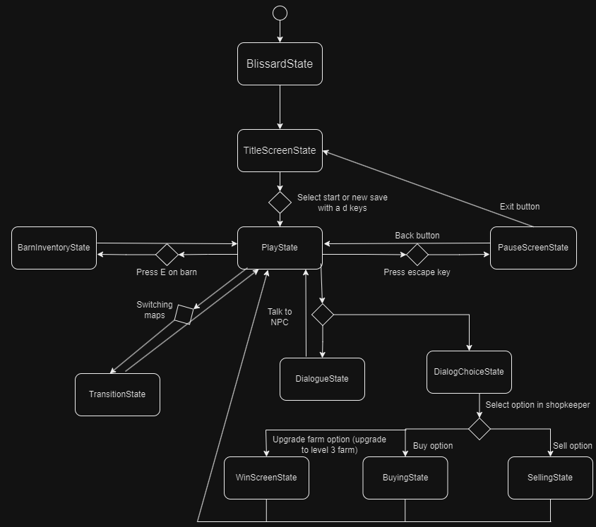
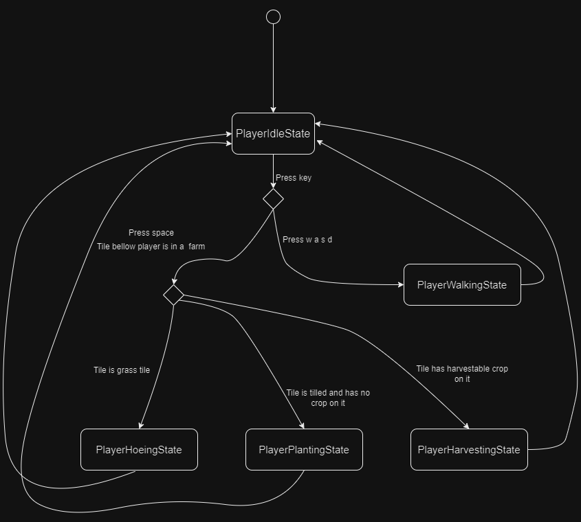
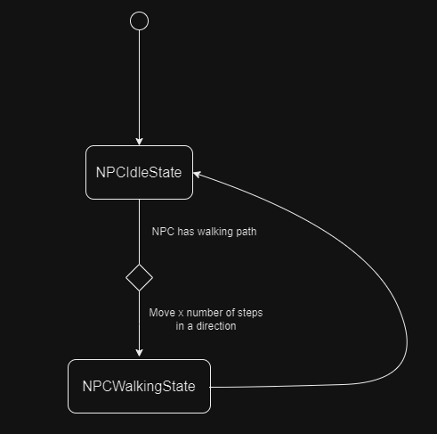
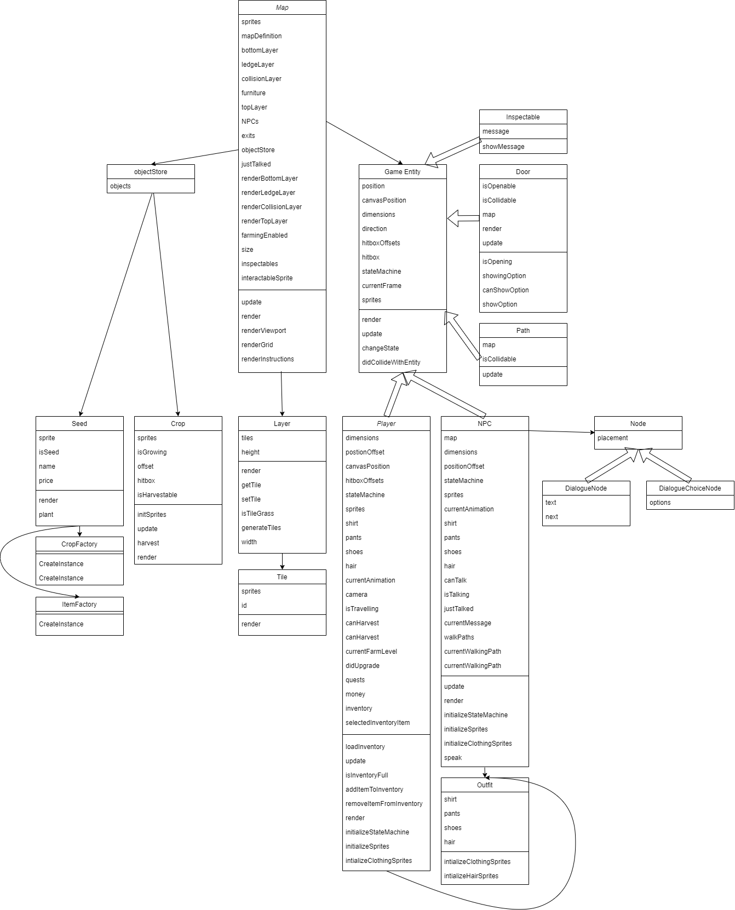
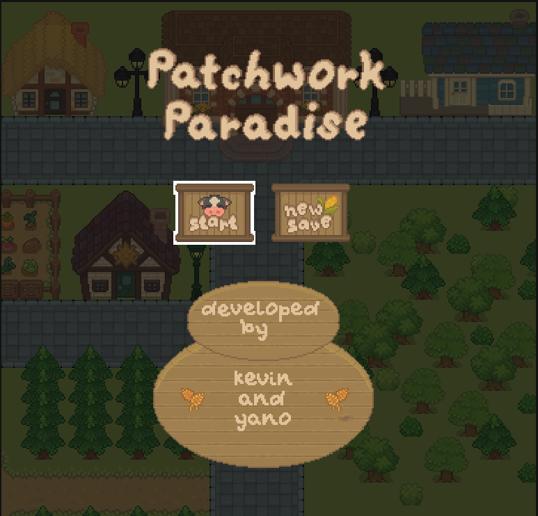
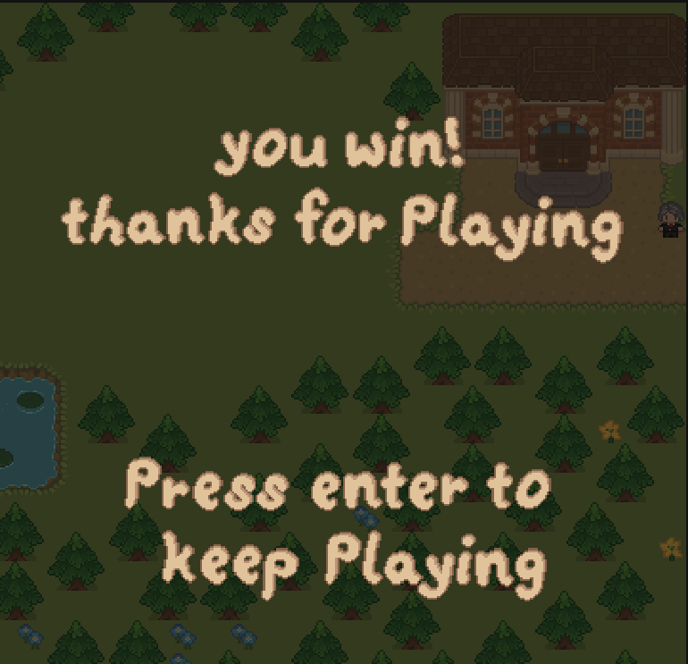
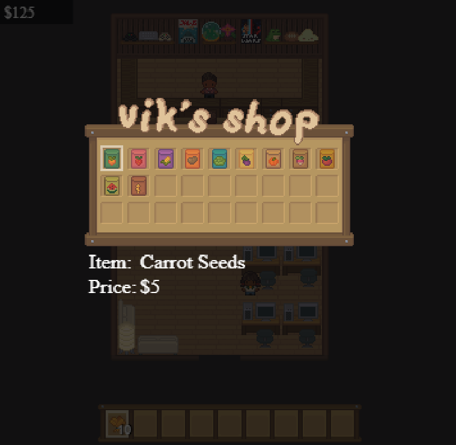
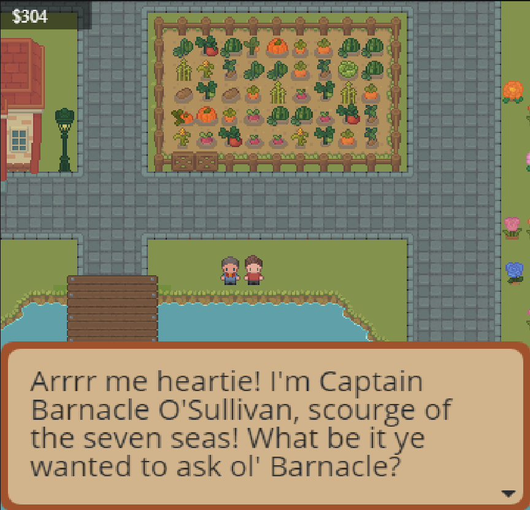

# 🧑‍🌾 Game Programming Final Project - Patchwork Paradis

## 🕹️ Gameplay & Description

Patchwork Paradise is a game about planting crops, selling them and buying a bigger house. The player starts the game with an old decrepit house and small plot of land they have to grow crops on so that they can sell them and earn money. In order to plant crops, players must first till the soil using their hoe. When the soil is tilled, the player must place a seed in the soil. After some time, the specific amount varies depending on the specific crop, the crop grows and can be harvested by the player. After harvesting the crop, it will appear in the player’s hotbar. They can choose to put it in storage in their house, or venture into town to sell it. With the money they earn from selling crops, players can buy a bigger and nicer house. Buying the next tier of house removes some trees on their property, granting them access to more farmland with which to grow more crops. This cycle continues until the player purchases the largest house, at which point they beat the game. The player can continue to play the game even after having bought the biggest house, but they won’t have any specific goal to reach for.

## 📃 Requirements

1. A controllable player
   - Player can walk up, down, left, right
   - Player can use a hoe on farmable land which will change the tile
   - Player can place crops from inventory
2. Two maps (One is players farm which is upgradable, another is a village where crops can be bought and sold)
3. Crops
   - Seeds bought from village go directly into player inventory
   - Crops grow bigger (to different crop states) after a certain amount of time until they are ready for harvest
   - Harvested crops go directly into player inventory
4. Dialog boxes
    - For information and tips
    - For npc conversations
5. Menu boxes for buying / selling crops
6. A camera will be used to follow the player across the map
7. A nice looking titlescreen
8. A pause state where the game can be saved
9. Farm land can be upgraded and expanded for more farmable land and a bigger houses

## 🤖 State Diagrams

> [!note]
> Remember that you'll need diagrams for not only game states but entity states as well.

### Game State Diagram

### Player State Diagram

### NPC State Diagram 

## 🗺️ Class Diagrams

## 🧵 Wireframes

The game aims to acheive a cartoonish pixelated look that is visually engaging as well as easily undestandable. This is acheieved in menus through the use of highlinging/arrows as well as by not overleading the user with information. For examplem the buying and selling UI are separated to ensure the user does not get confused when buying and selling items.

## 🥕 Game Entities and Objects

The only game entities planned for the game are the player and NPCs. The player entity represents the player playing the game and is controlled by them. The player can walk around, use their hoe to till the soil so it can be ready for planting, plant crops using seeds and finally, interact with NPCs. NPCs are the other entity that can be interacted with, there are several 'jobs' these NPCs can have. The way the player interacts with them is based on the job they hold, for example, shopkeeper NPCs sell things to the player. Most NPCs are filler characters, serving no purpose in terms of progression but allowing the player to explore the world and learn more about the town.

As a farming game with a large variety of crops, the number of entities we will have is very large. That being said, all crops will inherit from the same parent class, making them extremely similar. Crops will differ in terms of the time it takes them to grow, whether they come from the ground or trees among other aspects. The other type of objects our game will have is buildings. These buildings will vary much like the NPCs previously talked about. There will be shops, homes, barns etc. These will however form part of the map, and so their state as objects is somewhat questionable, though since the player can change their house they have been put here.

## 🎨 Assets

The asset packs that we are using for Patchwork Paradise are the "Cozy Farm" and "Cozy People'' Asset packs, both made by [this artist](https://shubibubi.itch.io/). The asset packs have a cozy, playful and relaxed aesthetic. They match the desired aesthetic for our game very well. The first asset pack contains all the farming related sprites like animals, homes and crops while the second contains important tools and assets to create characters.

We used [app.diagrams.net](https://app.diagrams.net/) to create the wireframes. Wireframes are the equivalent to the skeleton of a web app since they are used to describe the functionality of the product and the user's experience.

We used [Tiled](https://www.mapeditor.org/) to create our maps for the game. Maps being the town and farm area.

## ✏️ Fonts

For fonts, we used the one that came in the sprite package for the title screen and pause screen.

## 🔊 Sounds

The use of sound effects and music is important to ensuring an immersive and enjoyable player experience. Examples of some of the music and sound effects have been linked below but due to the amount of sounds and music needed, only a small sample are present here.

- [Ambient music](https://pixabay.com/music/beautiful-plays-ambient-piano-and-strings-10711/)
- [Hoe sound](https://freesound.org/people/lollosound/sounds/124916/)
- [Walking sound](https://pixabay.com/sound-effects/search/walking/)

## 🏡 Win Conditions

Our game does not have any explicit "lose" condition, as the game is meant to last forever. That being said, the game does have a "win" condition. As the player grows and sells more crops they are able to earn money which they can use to buy a bigger and nicer house, bigger homes allow more storage space for crops and expand the territory the player can grow crops. When the player buys the biggest house, they have effectively won the game, making buying the biggest house our win condition.

## 💾 Saving & Loading

For persistence, we use json to save the location of crops, current amount of money, crops in inventory, and which upgraded farm you currently have. Saving will be done by going to your farm and selecting the save option. The title screen will have an option to load the game or to start a new game.

